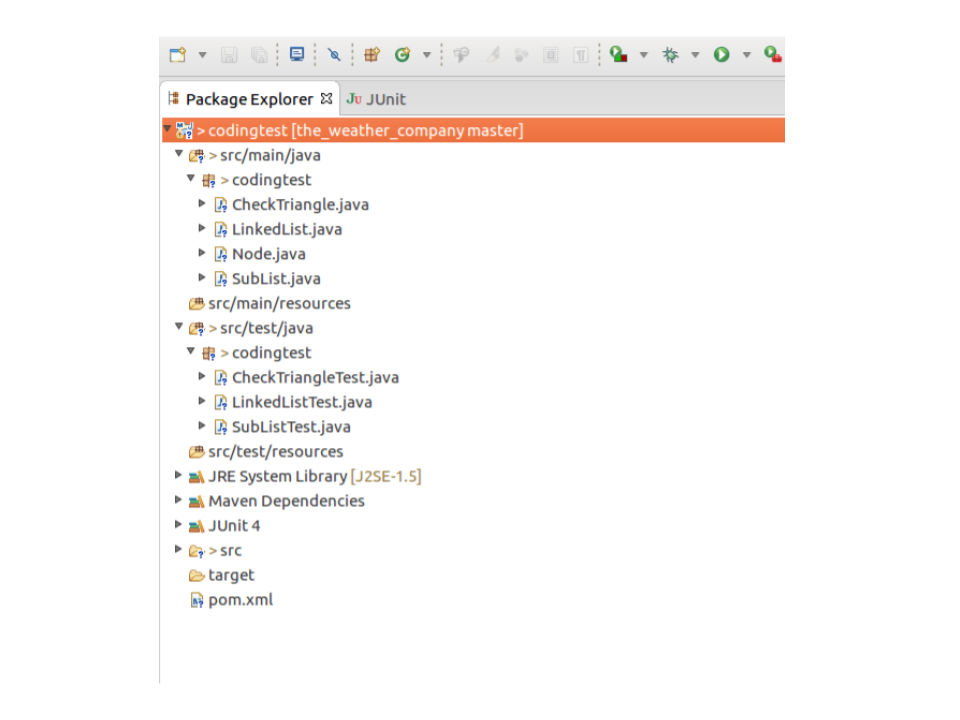
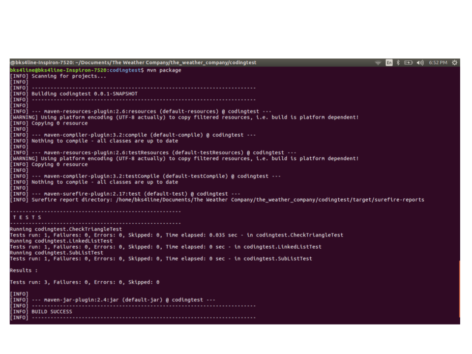
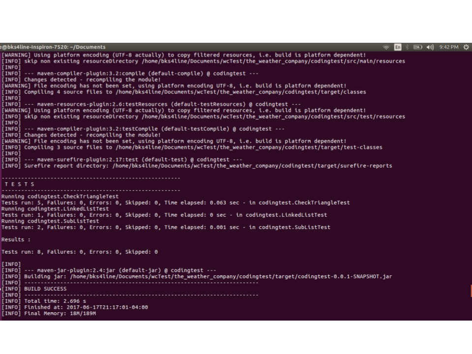
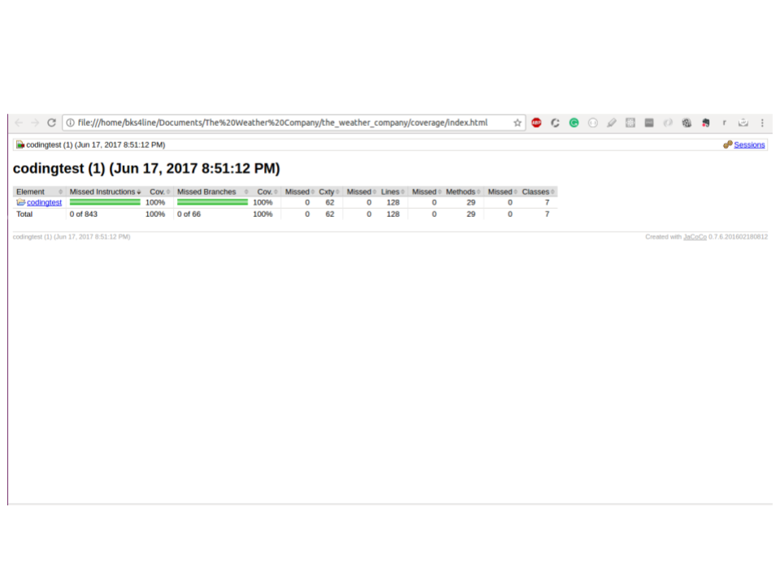

# The Weather Company
This repository has two folders

  1. codingtest (Contains the problem sets)
  2. coverage (Results of code coverage as Html files)

### Prerequisites:
------------------
  Install maven
  `sudo apt install maven`

   After you install check for maven version and machine specs. Here is my system specs. The program should run seamlessly if the user has similar specs as mine

  `mvn --version`

 `Apache Maven 3.3.9`  
 `Maven home: /usr/share/maven`    
 `Java version: 1.8.0_131, vendor: Oracle Corporation`     
 `Java home: /usr/lib/jvm/java-8-oracle/jre`    
 `Default locale: en_US, platform encoding: UTF-8`   
 `OS name: "linux", version: "4.4.0-79-generic",arch:   "amd64",family: "unix"`

### Download
-------------

  `git clone https://github.com/karthikBalasubramanian/the_weather_company.git`

  As you download from your command prompt, you will see a new folder called "the_weather_company" under your present working directory.

### Package Structure
-------------------------

There are two source folders
1. `src/main/java/codingtest` - contains the program logic.
2. `src/test/java/codingtest` - contains the unit test classes for the program logic.

### Build
-------------------

  `mvn package`

  you should get a build output like this for a successful build.

  
  

### Coverage
------------------

[ECL Emma](http://www.eclemma.org/jacoco/) is the code coverage tool that is used to get code coverage reports. Use [installation  instructions](http://www.eclemma.org/installation.html#marketplace) to download this eclipse plug-in.

After installing the plug-in

`Right click project -> Coverage As -> JUnit Test`

set your download location with folder named **coverage**.

got to **coverage** folder and click **index.html** and navigate  via hyper links to check code coverage of specific classes.

