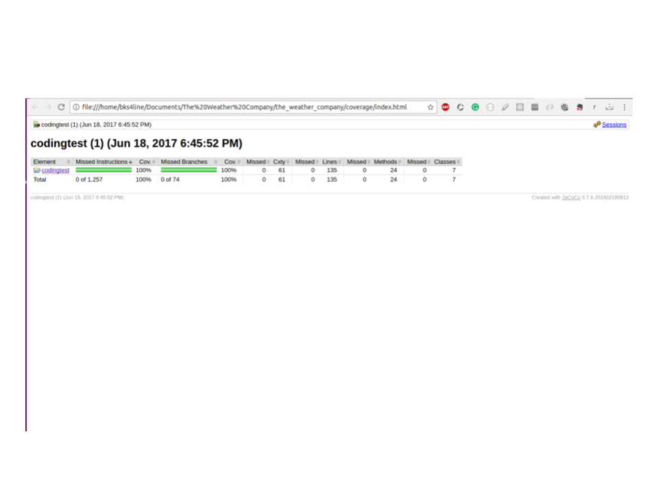

# The Weather Company

  

This repository has four folders

  1. codingtest (Contains the problem sets)
  2. coverage (Results of code coverage as Html files)
  3. Javadocs (Documentation of classes and their methods).
  4. outputs (screen shots of some of the outputs).

### Assumptions
--------------------

1. CheckTriangle.class - Inputs (sides of the triangle) are of type Double/double.

2. LinkedList.class - My LinkedList implementation is a List of Integers with a next pointers going in forward direction. So if asked to return the 5th element from the back of the list, the program would return fifth Integer from the back, if it exists.

3. SubList.class -  Takes two ArrayList<?> (any type) and compares if either of the list is a sublist of another. It cannot compare two lists of different types (This condition is captured in the code. Program will not fail in any case). Tested for all primitive types (Integer,Double,String).

### Prerequisites:
------------------
  Install maven
  `sudo apt install maven`

   After you install check for maven version and machine specs.

  `mvn --version`

 `Apache Maven 3.3.9`  
 `Maven home: /usr/share/maven`    
 `Java version: 1.8.0_131, vendor: Oracle Corporation`     
 `Java home: /usr/lib/jvm/java-8-oracle/jre`    
 `Default locale: en_US, platform encoding: UTF-8`   
 `OS name: "linux", version: "4.4.0-79-generic",arch:   "amd64",family: "unix"`

### Download
-------------

  `git clone https://github.com/karthikBalasubramanian/the_weather_company.git`

  As you download from your command prompt, you will see a new folder called **the_weather_company** under your present working directory.

### Package Structure
-------------------------

There are two source folders
1. `src/main/java/codingtest` - contains the program logic.
2. `src/test/java/codingtest` - contains the unit test classes for the program logic.

### Build
-------------------

  `mvn package`

  you should get a build output like this for a successful build.

  

### Coverage
------------------

[ECL Emma](http://www.eclemma.org/jacoco/) is the code coverage tool that is used to get code coverage reports. Use [installation  instructions](http://www.eclemma.org/installation.html#marketplace) to download this eclipse plug-in.

After installing the plug-in

`Right click project -> Coverage As -> JUnit Test`

set your download location with folder named **coverage**.

got to **coverage** folder and click **index.html** and navigate  via hyper links to check code coverage of specific classes.

### Javadocs
--------------

 Generated javadocs can be found in the **javadocs** folder. Open **index.html** to navigate through all the classes and their documentation. Your javadocs should be like this.

 
